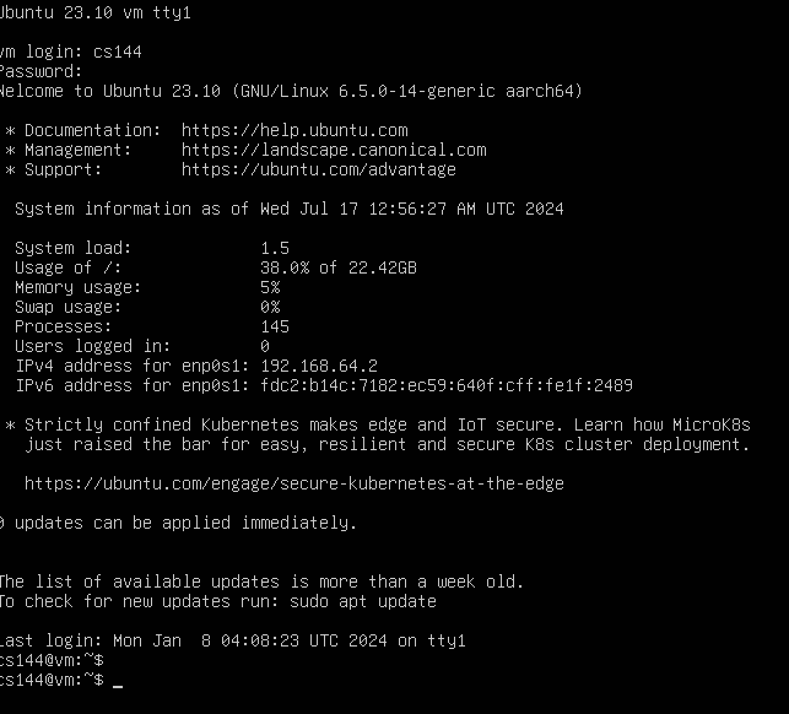
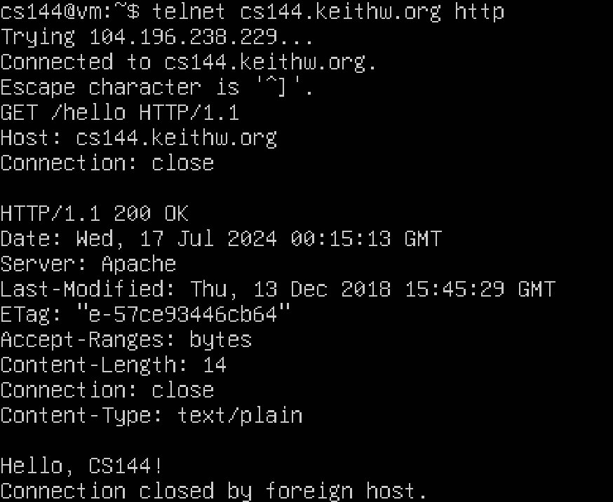
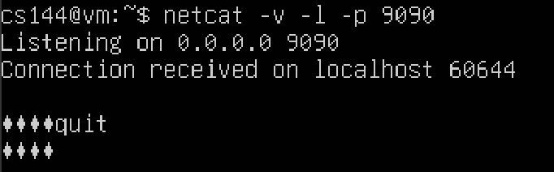
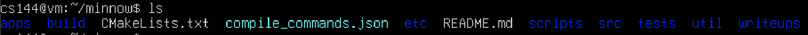

# Networking warmup

## 1 Set up GNU/Linux on your computer
根据各自系统选择下载镜像。注意，你可能不知道用户和密码。
```
The VM will boot to a textual interface. Your username is cs144 , and the default password is also cs144 .
```


## 2 Networking by hand
### 2.1 Fetch a web page


#### 3 Assigment 
最紧要就是快，不然就是408timeout。<br> 
Connection: close 是默认设置 可以不传入headers.<br>


### 2.2 Send yourself an email
需要学校内部账号或者赞助，工作人员。我不符合条件，选择了解过程。

### 2.3 Listening and connecting
切换tty以达到不同terminal的通信


## 3 Writing a network program using an OS stream socket

介绍了TCP以及展望后续Lab内容
在实际网络中，互联网并不提供可靠的字节流。<br>
他们往往“尽力而为”，也被叫做互联网数据报。
* headers (some metadata): source, destination address
* payload data

数据报可能出现的问题
* lost
* delivered out of order
* delivered with the contents altered
* duplicated and delivered more than once

### 3.1 Let’s get started—fetching and building the starter code
下载安装好对应资源


### 3.2 Modern C++: mostly safe but still fast and low-level
一些规范
*  Use the language documentation at https://en.cppreference.com as a resource. (We’d
recommend you avoid cplusplus.com which is more likely to be out-of-date.)
*  Never use malloc() or free().
*  Never use new or delete.
*  Essentially never use raw pointers (*), and use “smart” pointers (unique ptr or
shared ptr) only when necessary. (You will not need to use these in CS144.)
*  Avoid templates, threads, locks, and virtual functions. (You will not need to use these
in CS144.)
*  Avoid C-style strings (char *str) or string functions (strlen(), strcpy()). These
are pretty error-prone. Use a std::string instead.
*  Never use C-style casts (e.g., (FILE *)x). Use a C++ static cast if you have to (you
generally will not need this in CS144).
*  Prefer passing function arguments by const reference (e.g.: const Address & address).
*  Make every variable const unless it needs to be mutated.
*  Make every method const unless it needs to mutate the object.
*  Avoid global variables, and give every variable the smallest scope possible.
*  Before handing in an assignment, run cmake --build build --target tidy for
suggestions on how to improve the code related to C++ programming practices, and
cmake --build build --target format to format the code consistently.

### 3.3 Reading the Minnow support code
一些关于Minnow须知
Please read over the public interfaces (the part that comes after “public:” in the files
util/socket.hh and util/file descriptor.hh. (Please note that a Socket is a type of
FileDescriptor, and a TCPSocket is a type of Socket.)

## Writing webget
主要是读老师给的文件，注意format代码。
```c++
void get_URL( const string& host, const string& path )
{
  Address addr = Address( host, "http" );
  TCPSocket tcp;
  string request = "GET " + path + " HTTP/1.1\r\n";
  request += "Host: " + host + "\r\n";
  request += "Connection: close \r\n";
  request += "\r\n";

  tcp.connect( addr );
  tcp.write( request );
  string response;
  while ( !tcp.eof() ) {
    tcp.read( response );
    cout << response;
  }
  tcp.close();
}
```

## An in-memory reliable byte stream
