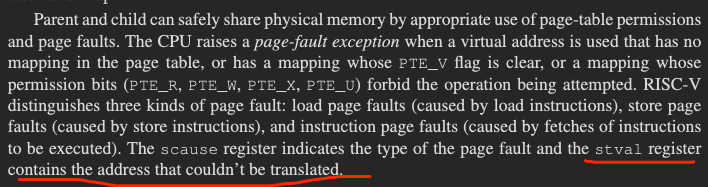
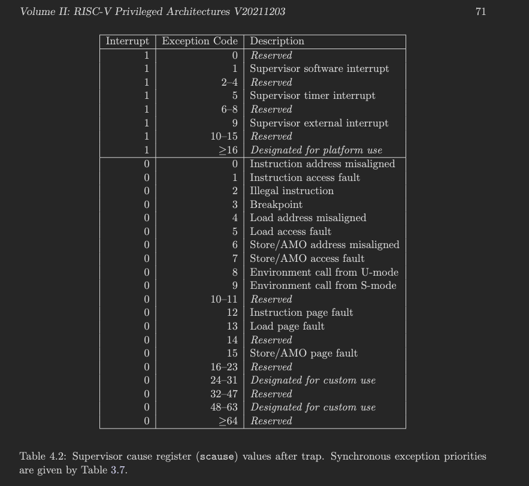
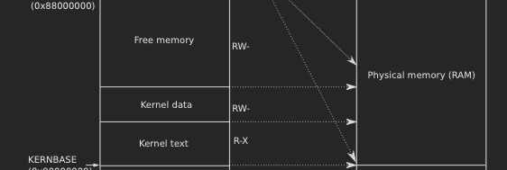

# Lab: Copy-on-Write Fork for xv6
## Implement copy-on-write fork(hard)

查找scause的值是多少为page fault

根据riscv-privilege 手册可得到，13,15为pagefault

可以看到pid为3时，引起了0xf的scause异常，据此，修改user_trap函数

注意还需要关注pa的引用问题，因为当cow的时候，一个物理地址会有两个引用，只有引用为0才能释放。

物理地址区域可得，又因为一页为4096

注意需要判断是cow才进行cowcopy,其他需要跳过.
在uvmcopy时需要进行ref增加,这里卡了很久
kalloc不能直接进行ref加一会异常,应该初始化为1