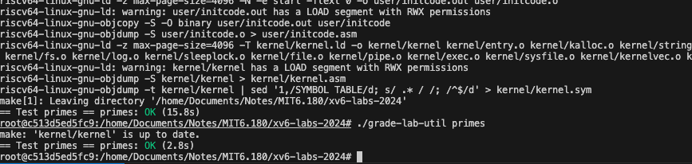

# Lab1
阅读handout中的chapter1.
[Lab: Xv6 and Unix utilities](https://pdos.csail.mit.edu/6.1810/2024/labs/util.html)

## 安装环境
[lab tools](https://pdos.csail.mit.edu/6.1810/2024/tools.html)

镜像安装ubuntu24.04
```
ubuntu:
    image: ubuntu:24.04
    volumes:
      - $DOCUMENT_PATH:/home/Documents
    networks:
      backend-activity:
        ipv4_address: $BACK_UBUNTU_IP
    container_name: ubuntu
    stdin_open: true
    tty: true
```

## Lab util: Unix utilities

### sleep(easy)
```c
#include "kernel/types.h"
#include "kernel/stat.h"
#include "user/user.h"


int
main(int argc, char *argv[])
{
  if ( argc < 2) {
    fprintf(2, "Pls send a number\n");
    exit(1);
  }
  sleep(atoi(argv[2]));
  fprintf(1, "(nothing happens for a little while)\n");
  exit(0);
}
```

```bash
./grade-lab-util sleep
```

开始的练手小作业，注意去MAKEFILE增加编译即可

### pingpong
```c
#include "kernel/types.h"
#include "kernel/stat.h"
#include "user/user.h"


int
main(int argc, char *argv[])
{
  int p[2]; 
  pipe(p);
  char buf[4];

  // child process
  if (fork() == 0) {
    read(p[0], buf, 5);   
    close(p[0]);
    write(p[1], "pong", 4);
    close(p[1]); 
    fprintf(1, "%d: receive %s \n", getpid(), buf); 
    exit(0);   
  } 

  write(p[1], "ping", 4);
  close(p[1]);
  // Parent process run here and wait child
  wait(0); //waitpid
  read(p[0], buf, 5);
  close(p[0]);
  fprintf(1, "%d: receive %s \n", getpid(), buf);
  exit(0);
}
```

### primes

[CSP Models](https://swtch.com/~rsc/thread/) csp模型讲述了并发进程的通信，推荐阅读。



卡了我好久，这一段，这是2024最新的课程，2到280区间的素数。
筛选逻辑就不说了，看论文就有，重点是这里的关闭管道文件，如果没有关闭管道，那么在到素数37的时候，你的资源就会耗尽。
pipe(p) 会返回-1.
还好阅读了book-riscv-rev4的内容，里面wc有一段代码
```c
if(fork() == 0) {
  close(0);
  dup(p[0]);
  close(p[0]);
  close(p[1]);
  exec("/bin/wc", argv);
}
```
这里告诉你如何提前利用标准输入去做fd，提前关闭管道。
完成这里之后如果显示有换行，记得在函数wait(0)。保证时序。
