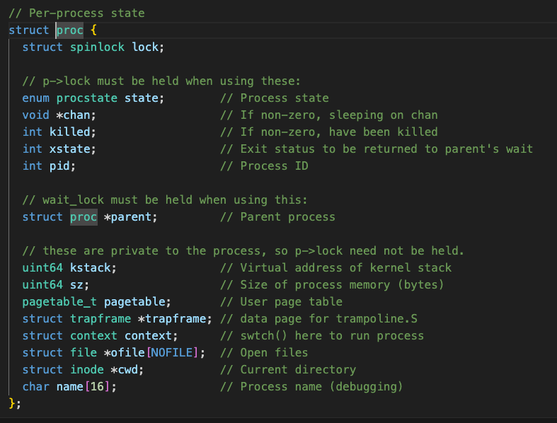
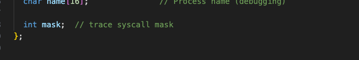

# Lab2

## Abstracting physical resources

## User mode,supervisor mode, and system calls

## Operating system organization

### Kernel organiztion


* monolithic kernel 性能高，内核一个模块出问题会影响整个系统，拓展性差，交互简单，因为共用一个内存空间。
* microkernel 灵活可靠，性能相对差，因为需要频繁的切换上下文

## 2.4Code:xv6 organization


## 2.5Process overview

* trampoline 跳板，4096byte，以实现函数调用和控制流的转移。
* trapframe 陷阱帧
    * 指令计数器(Programe Counter PC) 指向当前正在执行的指令的地址
    * 栈指针(Stack Pointer SP) 指向当前线程的栈顶位置。
    * 寄存器状态
    * 中断或者其他异常类型
通过trampoline和trapframe实现转换进入内核和返回。
trampoline实现内核的进入和返回，trapframe保存了进城的状态和信息。

### import pieces

```c
strcut proc {
    kstack // kernel stack
    state // indicates whether the processes is allocated, ready to run, currently running on a CPU, wait for I/O, exiting
    pagetable // xv6 casusing paging hardware to use a pagetable when executing that  process in a user space, also serves as the record of addresses of the physical pages allocated to store the process's memory.
}
//...
```

* kernel state
* page table
* kernel stack(p->kstack): each process has two stack, kernel stack and process stack
* run state

### Summary

A address space to give a process illusion of its own memory
A thread to give the process the illusion of its own CPU

## 2.6 the first process and system call
概述一个系统如何启动


## 2.7 Security Model

系统必须假设用户层代码会尽全力破坏内核或者其他进城。如果用户层代码访问地址超出了允许的地址空间，那么就可能访问到指令集,即使这不是为用户层设计的。
他可能试图读或者写内核的控制寄存器。也可能直接访问设备硬件，甚至传递一些参数导致系统崩溃。

## 2.8 Real World

# lab

```zsh
# 窗口1
make qemu-gdb
# 窗口2
gdb-multiarch
# 加载.gdbinit
source .gdbinit
```
## Using gdb (easy)

### Looking at the backtrace output, which function called syscall?


### What is the value of p->trapframe->a7 and what does that value represent? (Hint: look user/initcode.S, the first user program xv6 starts.)


### What was the previous mode that the CPU was in?


可以知道ssp在第8位，0010,0010后八位中，ssp=0

### Write down the assembly instruction the kernel is panicing at. Which register corresponds to the variable num?


执行


将地址0x0的特殊寄存器0加载到a3 寄存器中。

###  Why does the kernel crash? Hint: look at figure 3-3 in the text; is address 0 mapped in the kernel address space? Is that confirmed by the value in scause above? (See description of scause in RISC-V privileged instructions)


### What is the name of the process that was running when the kernel paniced? What is its process id (pid)?




#### Figure3

* Sv39 only use 39bits of a 64-bit virtual address
* PTEs 2的27次方 to find a PTE and make the 56-bit physical address by 44-bit from PPN and whose bottom 12 bits are copied from the original virtual address.
* PPN 44-bit physical page number(PPN)


* TLB(Translation Look-aside Buffer),用户缓存虚拟地址与物理地址的映射关系，因为使用了三层PTEs结构，内存需要加载三层的PTEs是一个潜在的性能隐患。


RISC-V address translation details

* satp(Supervisor Address traslation and protection register)
    * Page Table Base Address:页表的基地址
    * Address Translation and Protection Mode:地址转换和保护模式，比如页表模式和分页模式
    * Address Space Protection:地址空间保护策略，比如访问权限控制，内存区域的可读执行属性


* CLINT(Core Local Interupt),处理器用于内部中断使用，管理处理器核心之间的中断和定时器事件。
* PLIC(Platform Level Interupt Controller),用于外部设备与处理器的中断分发控制器，PLIC会根据不同优先级发出对应不同设备的中断信号，用以管理设备的运行与中止。
* UART(Universal Asynchronous Receiver Transmitter),用于与外部设备的串行通信。
* VIRTIO disk,用于虚拟化存储方案，一般用于虚拟机或者虚拟容器
* Guard page,用于内存的保护和检测，目的是防止错误的读取和写入超出范围的数据。

##### Kernel address space

* PHYSTOP 定义了物理地址的顶值
* KERNBASE (kernel base address),内核虚拟地址的基准起始地址。

The kernel gets at RAM and memory-mapped device registers using "direct mapping" that is mapping the resources at virtual addressses that are equal to the physical address.

There are a couple of kernel virtual addresses that aren't direct-mapped:
* The trampoline page. It is mapped at the top of virtual address space;
* The kernel stack pages. Each process has its own kernel stack,which is mapped high so that below it xv6 can leave an unmapped guard page.The guard page's PTE is invalid, so that if the kernel overflows a kernel stack, it will likely cause an exception and the kernel will panic.

##### Code:creating an address space

* sfence(store fence),存储屏障，用于保障存储指令在乱序中能够保持一致，保证等待之前的更新操作必须完成。

##### Physical memory allocation

##### Code:Physical memory allocator

* PGROUNDUP 定义了对齐的大小，通常是4KB

#### Process address space

use many permission to control user address space, like PTE_R,PTE_W,PTE_X.PTE_U
And use guard page to avoid accessing the disallowed address.


summary


#### Code:sbrk


#### Code:exec

* ELF(Executable and Linked Format)可执行文件，目标文件，共享库标准文件格式。
    ** elfhdr elf头，包含elf格式的文件信息
    ** progvhdr 程序头，包含指令和数据

#### Real World

## System call tracing (moderate)

按照hint指示操作即可完成这个lab





## Attack xv6 (moderate)

### 边界对齐


从secret我们可以轻易可得代码

但是实际上无法获得secret，因此需要继续阅读代码。
```c
struct run {
  struct run *next;
};

struct {
  struct spinlock lock;
  struct run *freelist;
} kmem;
```
可以看到run是一个链表结构。
kmem通过*freelist管理空闲内存。如果需要分配内存，那么可以从头部移除一个节点。
如果需要释放内存，那么在freelist增加一个节点。

```c
// Allocate one 4096-byte page of physical memory.
// Returns a pointer that the kernel can use.
// Returns 0 if the memory cannot be allocated.
void *
kalloc(void)
{
  struct run *r;

  acquire(&kmem.lock);
  r = kmem.freelist;
  if(r) {
    kmem.freelist = r->next;
  }
  release(&kmem.lock);
#ifndef LAB_SYSCALL
  if(r)
    memset((char*)r, 5, PGSIZE); // fill with junk
#endif
  return (void*)r;
}
```

可以看到每次kalloc都从freelist的头部分配一个空闲内存块。

```c
sz = PGROUNDUP(sz);
uint64 sz1;
if((sz1 = uvmalloc(pagetable, sz, sz + (USERSTACK+1)*PGSIZE, PTE_W)) == 0)
  goto bad;
sz = sz1;
uvmclear(pagetable, sz-(USERSTACK+1)*PGSIZE);
sp = sz;
stackbase = sp - USERSTACK*PGSIZE;

// Push argument strings, prepare rest of stack in ustack.
for(argc = 0; argv[argc]; argc++) {
  if(argc >= MAXARG)
    goto bad;
  sp -= strlen(argv[argc]) + 1;
  sp -= sp % 16; // riscv sp must be 16-byte aligned
  if(sp < stackbase)
    goto bad;
  if(copyout(pagetable, sp, argv[argc], strlen(argv[argc]) + 1) < 0)
    goto bad;
  ustack[argc] = sp;
}
ustack[argc] = 0;

// push the array of argv[] pointers.
sp -= (argc+1) * sizeof(uint64);
sp -= sp % 16;
if(sp < stackbase)
  goto bad;
if(copyout(pagetable, sp, (char *)ustack, (argc+1)*sizeof(uint64)) < 0)
  goto bad;

// arguments to user main(argc, argv)
// argc is returned via the system call return
// value, which goes in a0.
p->trapframe->a1 = sp;
```
阅读exec代码，可以看到这里首页分配了两页，一页作为内核使用，一页作为USERSTACK使用。
从尾部往头开始，先存放了argv的实际字符串，之后设置了对应的指针。a1存放了argv的指针。

```c
// Commit to the user image.
oldpagetable = p->pagetable;
p->pagetable = pagetable;
p->sz = sz;
p->trapframe->epc = elf.entry;  // initial program counter = main
p->trapframe->sp = sp; // initial stack pointer
proc_freepagetable(oldpagetable, oldsz);
```

这里可以看到，这里会替换pagetable,并且free旧的pagetable

```c
// Free user memory pages,
// then free page-table pages.
void
uvmfree(pagetable_t pagetable, uint64 sz)
{
  if(sz > 0)
    uvmunmap(pagetable, 0, PGROUNDUP(sz)/PGSIZE, 1);
  freewalk(pagetable);
}
```
分析uvmfree函数。

```c
// Free the page of physical memory pointed at by pa,
// which normally should have been returned by a
// call to kalloc().  (The exception is when
// initializing the allocator; see kinit above.)
void
kfree(void *pa)
{
  struct run *r;

  if(((uint64)pa % PGSIZE) != 0 || (char*)pa < end || (uint64)pa >= PHYSTOP)
    panic("kfree");


#ifndef LAB_SYSCALL
  // Fill with junk to catch dangling refs.
  memset(pa, 1, PGSIZE);
#endif
  
  r = (struct run*)pa;

  acquire(&kmem.lock);
  r->next = kmem.freelist;
  kmem.freelist = r;
  release(&kmem.lock);
}
```

聚焦于kfree函数，可以看见旧的空闲内存是从头部添加回来的。
可以知道空闲列表会从小到大插入头部，因此，最末尾的空闲页将会在新的freelist头部。
secret在第10页，因此反排后，可以知道32～10，需要前进22页。


由断点打印可知道，释放了36页，我们只需要关注前22页。
每次分配4页，

```log
secret: start 
kalloc: addr_page:556844 
kalloc: addr_page:556843 
kalloc: addr_page:556885 
kalloc: addr_page:556884 
kalloc: addr_page:556883 
kalloc: addr_page:556867 
kalloc: addr_page:556839 
kalloc: addr_page:556842 
kalloc: addr_page:556841 
kalloc: addr_page:556840 
kalloc: addr_page:556882 
kalloc: addr_page:556854 
kalloc: addr_page:556855 
kalloc: addr_page:556881 
kalloc: addr_page:556869 
kalloc: addr_page:556868 
kalloc: addr_page:556880 
kalloc: addr_page:556828 
kalloc: addr_page:556827 
kalloc: addr_page:556826 
kalloc: addr_page:556825 
kalloc: addr_page:556824 
kalloc: addr_page:556823 
kalloc: addr_page:556822 
kalloc: addr_page:556821 
kalloc: addr_page:556820 
kalloc: addr_page:556819 
kalloc: addr_page:556818 
kalloc: addr_page:556817 
kalloc: addr_page:556816 
kalloc: addr_page:556815 
kalloc: addr_page:556814 
kfree: addr_page:556838 
kfree: addr_page:556848 
kfree: addr_page:556851 
kfree: addr_page:556852 
kfree: addr_page:556853 
kfree: addr_page:556844 
kfree: addr_page:556843 
kfree: addr_page:556885 
kfree: addr_page:556884 
kfree: addr_page:556883 
kfree: addr_page:556867 
kfree: addr_page:556839 
kfree: addr_page:556842 
kfree: addr_page:556841 
kfree: addr_page:556840 
kfree: addr_page:556882 
kfree: addr_page:556854 
kfree: addr_page:556855 
kfree: addr_page:556881 
kfree: addr_page:556869 
kfree: addr_page:556868 
kfree: addr_page:556880 
kfree: addr_page:556828 
kfree: addr_page:556827 
kfree: addr_page:556826 
kfree: addr_page:556825 
kfree: addr_page:556824 
kfree: addr_page:556823 
kfree: addr_page:556822 
kfree: addr_page:556821 
kfree: addr_page:556820 
kfree: addr_page:556819 
kfree: addr_page:556818 
kfree: addr_page:556817 
kfree: addr_page:556816 
kfree: addr_page:556815 
kfree: addr_page:556814 
kfree: addr_page:556850 
kfree: addr_page:556849 
kfree: addr_page:556847 
kfree: addr_page:556846 
kfree: addr_page:556845 
kalloc: addr_page:556845 
kalloc: addr_page:556846 
kalloc: addr_page:556847 
kalloc: addr_page:556849 
kalloc: addr_page:556850 
kalloc: addr_page:556814 
kalloc: addr_page:556815 
kalloc: addr_page:556816 
kalloc: addr_page:556817 
kalloc: addr_page:556818 
kalloc: addr_page:556819 
kalloc: addr_page:556820 
kalloc: addr_page:556821 
kalloc: addr_page:556822 
kalloc: addr_page:556823 
kalloc: addr_page:556824 
kalloc: addr_page:556825 
kalloc: addr_page:556826 
kalloc: addr_page:556827 
kalloc: addr_page:556828 
kalloc: addr_page:556880 
kfree: addr_page:556814 
kfree: addr_page:556817 
kfree: addr_page:556818 
kfree: addr_page:556819 
kfree: addr_page:556816 
kfree: addr_page:556815 
kfree: addr_page:556850 
kfree: addr_page:556849 
kfree: addr_page:556847 
kfree: addr_page:556820 
attack: start 
kalloc: addr_page:556820 
kalloc: addr_page:556847 
kalloc: addr_page:556849 
kalloc: addr_page:556850 
kalloc: addr_page:556815 
kalloc: addr_page:556816 
kalloc: addr_page:556819 
kalloc: addr_page:556818 
kalloc: addr_page:556817 
kalloc: addr_page:556814 
kalloc: addr_page:556868 
kalloc: addr_page:556869 
kalloc: addr_page:556881 
kalloc: addr_page:556855 
kalloc: addr_page:556854 
kalloc: addr_page:556882 
kalloc: addr_page:556840 
kalloc: addr_page:556841 
kalloc: addr_page:556842 
kalloc: addr_page:556839 
kalloc: addr_page:556867 
kalloc: addr_page:556883 
kalloc: addr_page:556884 
kalloc: addr_page:556885 
kalloc: addr_page:556843 
kalloc: addr_page:556844 
kalloc: addr_page:556853 
kalloc: addr_page:556852 
kalloc: addr_page:556851 
kalloc: addr_page:556848 
kalloc: addr_page:556838 
kalloc: addr_page:556813 
```

通过print打印日志，可以得知page页数。现在回想，可能使用gdb可能更加方便。

 第十六位
32位是因为需要存储指针，8byte