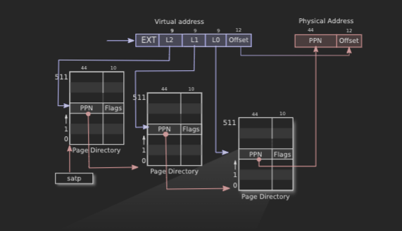

# Lab3
page tables

## prepare

read xv6 chapter3

## Inspect a user-process page table (easy)

### For every page table entry in the print_pgtbl output, explain what it logically contains and what its permission bits are. Figure 3.4 in the xv6 book might be helpful, although note that the figure might have a slightly different set of pages than process that's being inspected here. Note that xv6 doesn't place the virtual pages consecutively in physical memory.


PTE >> 10 获得PPN， << 12 留出offset位，得到pa。
PTE & 0x3ff,0x3ff是10位的mask,用于获得Flags

## Speed up system calls (easy)

仿造着TRAPFRAME添加USYSCALL代码
```c
void
proc_freepagetable(pagetable_t pagetable, uint64 sz)
{
  uvmunmap(pagetable, TRAMPOLINE, 1, 0);
  uvmunmap(pagetable, TRAPFRAME, 1, 0);
#ifdef LAB_PGTBL
  uvmunmap(pagetable, USYSCALL, 1, 0);    
#endif  
  uvmfree(pagetable, sz);
}

...
#ifdef LAB_PGTBL
  if(mappages(pagetable, USYSCALL, PGSIZE,
              (uint64)(p->usyscall), PTE_U | PTE_R ) < 0){
    uvmunmap(pagetable, TRAMPOLINE, 1, 0);
    uvmunmap(pagetable, TRAPFRAME, 1, 0);
    uvmfree(pagetable, 0);
    return 0;
  }
#endif

...
#ifdef LAB_PGTBL
  if((p->usyscall = (struct usyscall *)kalloc()) == 0){
      freeproc(p);
      release(&p->lock);
      return 0;
  }
  p->usyscall->pid = p->pid;
#endif

...
#ifdef LAB_PGTBL
  struct usyscall *usyscall;
#endif
```

## Print a page table (easy)
```c
void
vmprint(pagetable_t pagetable) {
  // your code here
  printf("page table %p\n", pagetable);
  pteprint(pagetable, 1);

}

void pteprint(pagetable_t pagetable, uint64 depth) {
  for(int i = 0; i < 512; i++){
    pte_t pte = pagetable[i];
    if(pte & PTE_V) {
      uint64 child = PTE2PA(pte);
      for (int i = 0; i < depth; i++) {
        printf(" ..");
      }
      uint64 va = i * PGSIZE;
      printf("%p: pte %p pa %p\n", (void *)va, (pte_t *)pte, (pte_t *)child);
      if ((pte & (PTE_R|PTE_W|PTE_X)) == 0) {
        pteprint((pagetable_t)child, depth+1);
      }
    }
  }
}
```
### For every leaf page in the vmprint output, explain what it logically contains and what its permission bits are, and how it relates to the output of the earlier print_pgtbl() exercise above. Figure 3.4 in the xv6 book might be helpful, although note that the figure might have a slightly different set of pages than the process that's being inspected here.
可以使用PTE_FLAGS获取对应的权限位

## Use superpages (moderate)/(hard)

