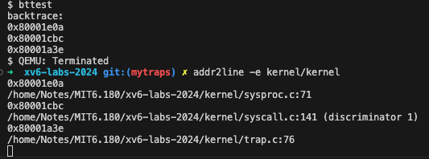

# Lab: traps
RISC-V assembly (easy)
## Which registers contain arguments to functions? For example, which register holds 13 in main's call to printf?
a0 cotain x argument to g function
a2 hold 13
## Where is the call to function f in the assembly code for main? Where is the call to g? (Hint: the compiler may inline functions.)
function f
26:	45b1                	li	a1,12
function g
14:	250d                	addiw	a0,a0,3 
## At what address is the function printf located?
0x6cc
## What value is in the register ra just after the jalr to printf in main?
jump 指令在0x30,因此ra应该为0x34，当到0x6cc执行完prinf后，跳回0x34继续执行指令
## What is the output? Here's an ASCII table that maps bytes to characters.The output depends on that fact that the RISC-V is little-endian. If the RISC-V were instead big-endian what would you set i to in order to yield the same output? Would you need to change 57616 to a different value?

```
	unsigned int i = 0x00646c72;
	printf("H%x Wo%s", 57616, (char *) &i);
```

He110, World
Big endian
He110, Wo
## In the following code, what is going to be printed after 'y='? (note: the answer is not a specific value.) Why does this happen?
```
	printf("x=%d y=%d", 3);
```
throw a exception, try to read an undifiend parameter

# Backtrace(moderate)



```c
void 
backtrace()
{
  printf("backtrace:\n");
  uint64 fp = r_fp();  
  
  while(fp > PGROUNDDOWN(fp)) {
    uint64* return_address = (uint64*)(fp-8);
    printf("0x%lx \n", *return_address);    
    fp = *(uint64*)(fp-16);
  }
}
```

# Alarm (hard)
```c
uint64 
sys_sigreturn(void)
{
  struct proc* proc = myproc();
  acquire(&proc->lock);
  memmove(proc->trapframe, proc->original_trapframe, sizeof(struct trapframe));
  proc->ban = 0;
  release(&proc->lock);
  return proc->trapframe->a0;
}

uint64
sys_sigalarm(void)
{
  int interval;
  uint64 handler;
  argint(0, &interval);
  argaddr(1, &handler);

  struct proc* proc = myproc();
  acquire(&proc->lock);
  proc->siginterval =  interval;
  proc->sighanlder =  handler;
  proc->alreadyTicks = 0;
  release(&proc->lock);
  // printf("init sys_sigalarm %d \n", interval);
  return 0;
}

...trap.c
// give up the CPU if this is a timer interrupt.
  if(which_dev == 2) {
    struct proc* proc = myproc();
    acquire (&proc->lock);
    myproc()->alreadyTicks++;
    if ( 
      proc->siginterval > 0 && 
      proc->alreadyTicks >= proc->siginterval &&
      !proc->ban
    ) {
      memmove(proc->original_trapframe, proc->trapframe, sizeof(struct trapframe));
      proc->alreadyTicks = 0;
      proc->trapframe->epc = proc->sighanlder;
      proc->ban = 1;
    } 
    release(&proc->lock);
    yield();
  }
```

