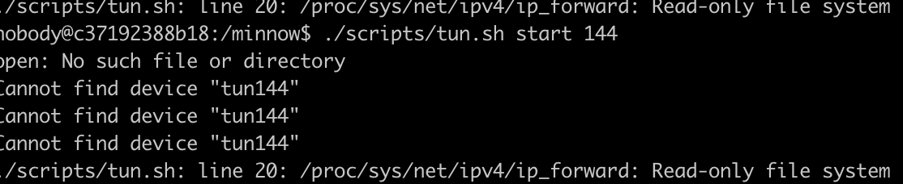

<!--
 * @Date: 2024-07-31 22:54:31
 * @LastEditors: LiShangHeng
 * @LastEditTime: 2024-07-31 23:22:14
 * @FilePath: /CS144/lab4.md
-->

# Checkpoint 4: interoperating in the world

这一张不需要写代码，注意如果是docker安装的镜像需要补齐环境。
./scripts/tun.sh start 144是无法用root用户运行的。

```zsh
# 因此需要创建一个新的用户。
docker --user username --it cs144 bash
# 还需要进入root
echo 'username:passwd123' | chpasswd
# 下载vim修改visudo
# 执行 visudo
# 在文本中添加 username ALL=(ALL:ALL) ALL
# apt install iproute2
# apt install iptables
```
之后依然出现了问题

```zsh
# apt-get install systemd
```

依然有问题，因为已经开始工作，决定不在环境上浪费时间。还是老老实实下载老师提供的镜像吧。
重新回check0下载，然后睡觉。