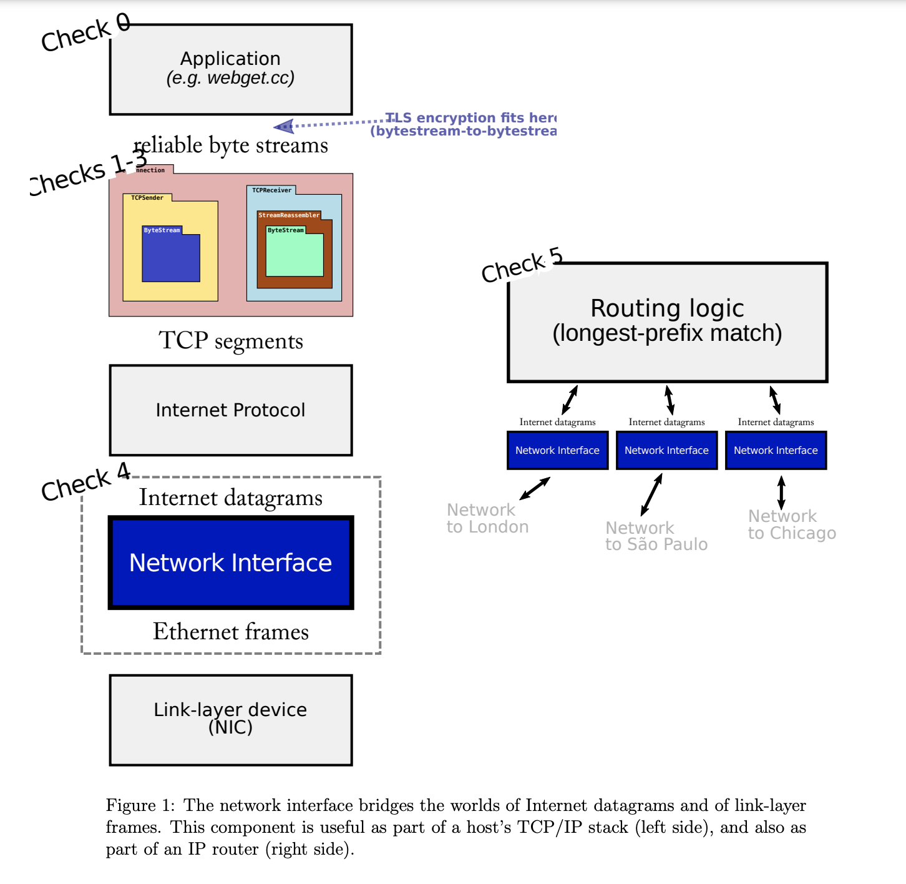
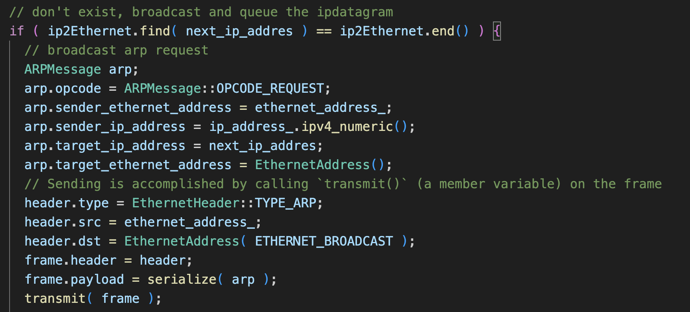

# Lab Checkpoint 5: down the stack (the network interface)
我们随着lab5继续走向网络接口层。

这个图是0-5的一个图解，可以以这张图做一个复习 
当看完check0的讲义后，可以开始进行代码。
我们创建一个arpMsg,之后放进ethernet frame的payload，设置好对应的ethernet header后，使用transmit方法进行广播

